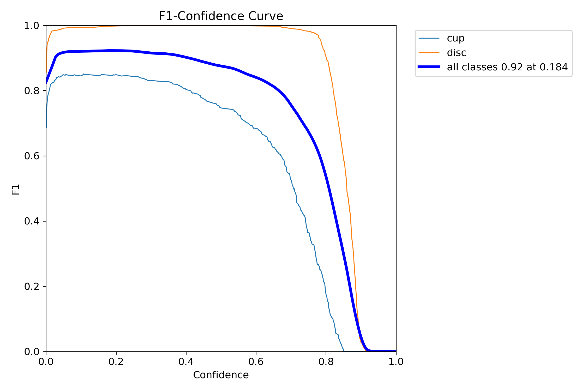
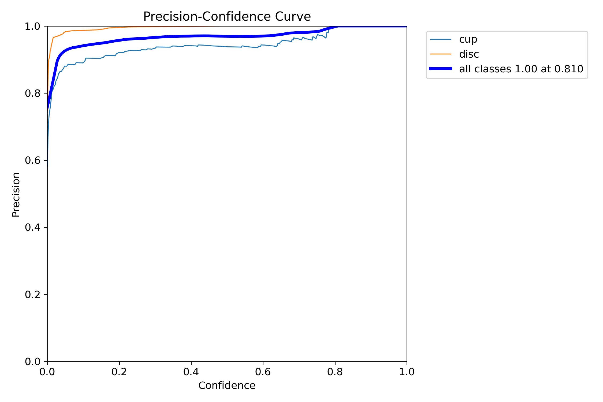
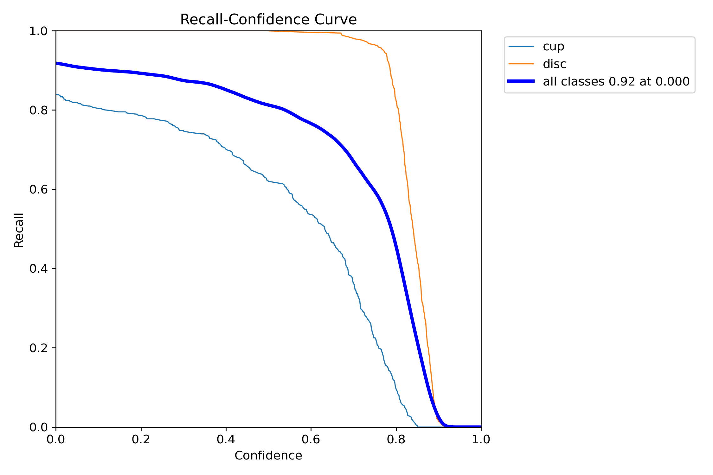
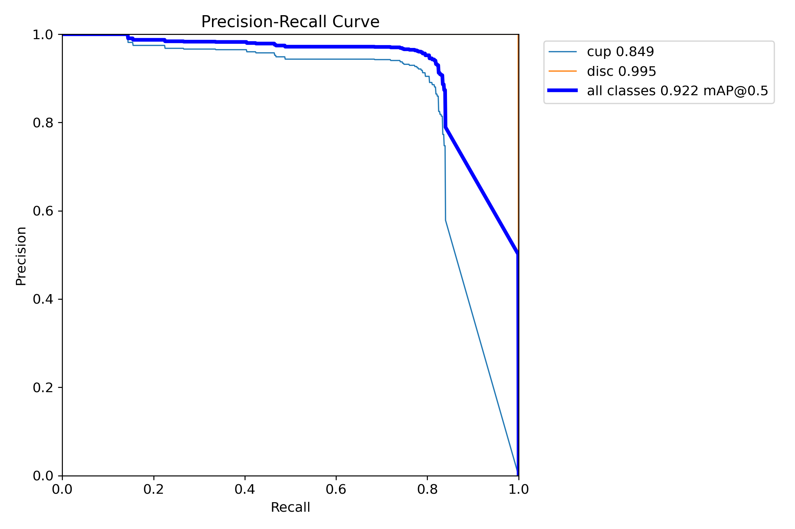
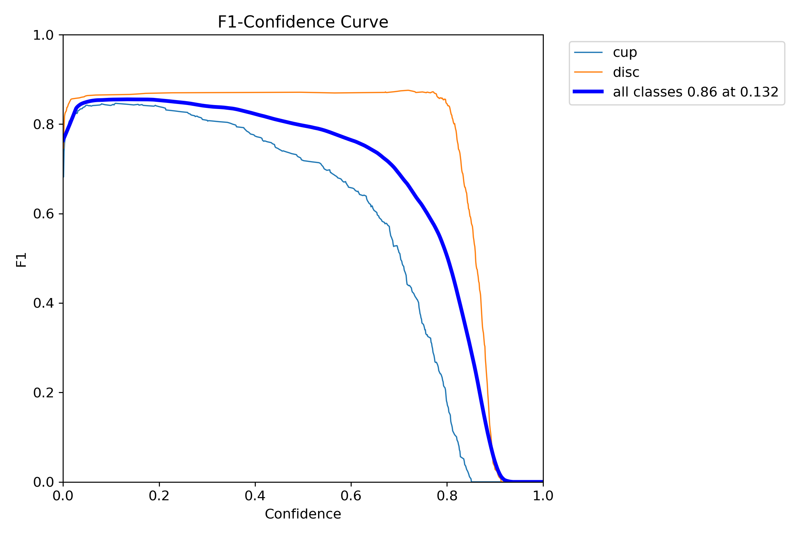
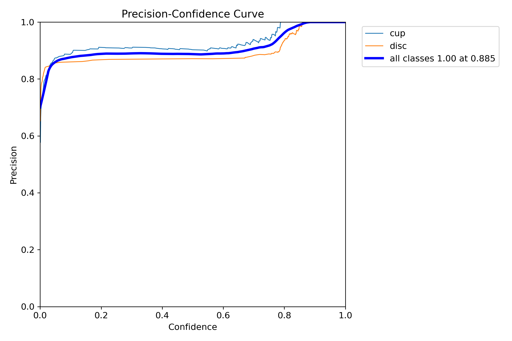
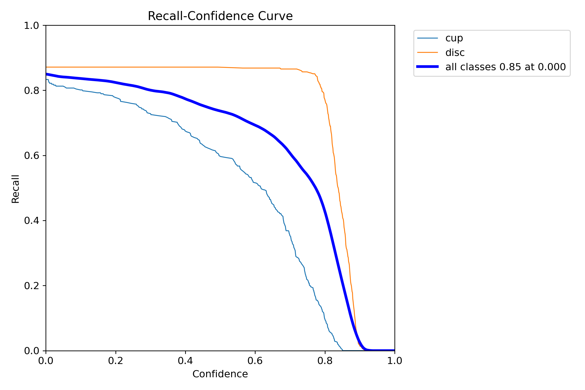
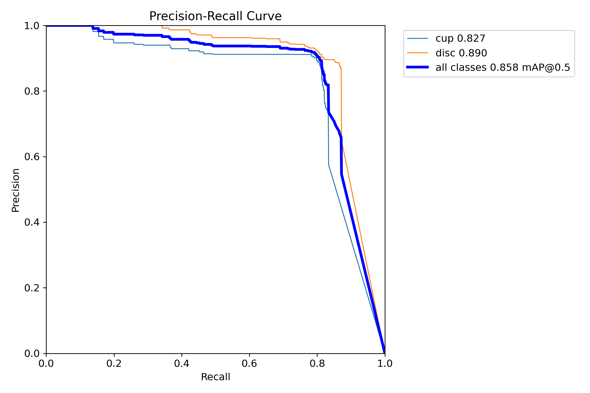

# YOLOv8_CDR

This study utilized YOLOv8 to segment the cup and disc areas in color fundus photography (CFP) captured by NIDEK and EIDON cameras, followed by the calculation of the cup-to-disc ratio for glaucoma detection.

This work utilizes the same dataset as the project available at [https://github.com/biodatlab/si-eye-screening](https://github.com/biodatlab/si-eye-screening)

## Dataset

|       | Total | Glaucoma (NIDEK/EIDON) | Normal (NIDEK/EIDON) |
| :---: | -----: | -----: | -----: |
| Train | 2,732 | | 
| Test  |   342 |               9 (1/8) | 333 (172/161) |
| Val   |   342 | | 

## Image segmentation

```
python src/train_yolov8.py
```

Training for 100 epochs 

|       | F1-score | Precision | Recall | Precision-Recall |
| :---: | -------- | --------- | ------ | ---------------- |
| Box   |  |  |  |  |
| Box   |  |  |  |  |

You can download the pre-trained model  [here](/model)

### Evaluation

Here's the data formatted as a markdown table:

| Class | Images | Instances | Box(P) | Box(R) | Box mAP50 | Box mAP50-95 | Mask(P) | Mask(R) | Mask mAP50 | Mask mAP50-95 |
|-------|--------|-----------|--------|--------|-----------|--------------|---------|---------|------------|---------------|
| all   | 342    | 684       | 0.978  | 0.968  | 0.983     | 0.708        | 0.974   | 0.963   | 0.980      | 0.580         |
| cup   | 342    | 342       | 0.957  | 0.936  | 0.972     | 0.555        | 0.963   | 0.942   | 0.973      | 0.552         |
| disc  | 342    | 342       | 1.000  | 1.000  | 0.995     | 0.862        | 0.985   | 0.985   | 0.986      | 0.609         |

## Glaucoma detection

This work detects glaucoma based on the cup-to-disc ratio (CDR). If the CDR is greater than 0.7, it is considered suspect for glaucoma; otherwise, it is classified as normal.

:exclamation: What are the differences between this work and the default inferencing?

1. Adjusting 'conf' and 'iou' in YOLOv8 Inference:

Default Inferencing:
```
results = model({image_path}, conf=0.25, iou=0.7)
```

This work's Inferencing:
```
results = model({image_path}, conf=0.001, iou=0.8)
```

&nbsp;&nbsp;&nbsp;&nbsp; For more details on adjusting parameters with YOLOv8, refer to the [documentation.](https://docs.ultralytics.com/usage/cfg/#predict-settings)

2. Handling Multiple Detections

&nbsp;&nbsp;&nbsp;&nbsp; Due to the parameter adjustments made in the previous step, it is possible to detect more than one cup and dis per image, which is unusual.

This work implements a simple logic to identify the correct cup and disc: It first identifies the largest dis that contains a cup. Then, it finds the largest cup within that dis.
```
code
```

<!-- What the different between this work ando default inferencing?

1. Adjusting 'conf' and 'iou' when inferencing with YOLOv8
    Default inferencing
    > results = model({image_path}, conf=0.25, iou=0.7)

    THis work inferencing 
    > results = model({image_path}, conf=0.001, iou=0.8)

    More detail for paremter adjusting with YOLOv8 [https://docs.ultralytics.com/usage/cfg/#predict-settings](https://docs.ultralytics.com/usage/cfg/#predict-settings)

2. Due to the previous step adjusting the parameter whrn inferenicng then it might be possible to detect more than one cup and dis per image which is not usually
    This work provide simple logic to find the cup and dis 
    First, this work find the largest disc with has cup inside
    Second, this work find the largest cup inside the largest disc

 -->
